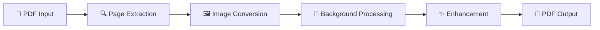

# 📄 PDF Background Cleaner

<div align="center">

[](https://python.org)
[](https://flask.palletsprojects.com/)
[](LICENSE)
[](https://github.com/yourusername/pdf-cleaner)

---

<p align="center">
  
</p>

</div>

## ✨ Features

<details open>
<summary>🔥 <strong>Core Features</strong></summary>

- 🎯 **Smart Background Removal** - Remove unwanted backgrounds from PDF documents
- 🖤 **Black & White Conversion** - Convert documents to clean black and white format
- 🎨 **Background Cleaning** - Keep content, remove noise and artifacts
- 📱 **Responsive Web Interface** - Modern, mobile-friendly design
- ⚡ **Fast Processing** - Optimized for speed and efficiency
- 📊 **Real-time Progress** - Live progress tracking during processing
- 🔒 **Secure Upload** - File size validation and secure handling
- 💾 **Instant Download** - Download processed files immediately

</details>

<details>
<summary>🛠️ <strong>Technical Features</strong></summary>

- 🐍 **Python Backend** - Built with Flask framework
- 🖼️ **Advanced Image Processing** - Using PIL and PyMuPDF
- 🎨 **Beautiful UI** - Bootstrap 5 with custom animations
- 📱 **Cross-platform** - Works on Windows, macOS, and Linux
- 🔄 **Auto-cleanup** - Temporary files automatically managed
- 📝 **Comprehensive Logging** - Detailed error tracking and debugging

</details>

---

## 🚀 Quick Start

### 📋 Prerequisites

Before you begin, ensure you have the following installed:

```bash
📦 Python 3.8 or higher
📦 pip (Python package installer)
📦 Git (optional, for cloning)
```

### 🔧 Installation

<div align="center">

```ascii
┌─────────────────────────────────────────┐
│  🎯 Step-by-Step Installation Guide     │
└─────────────────────────────────────────┘
```

</div>

1. **Clone or Download the Repository**

   ```bash
   git clone https://github.com/yourusername/pdf-cleaner.git
   cd pdf-cleaner
   ```

2. **Create Virtual Environment** (Recommended)

   ```bash
   # Windows
   python -m venv venv
   venv\Scripts\activate

   # macOS/Linux
   python3 -m venv venv
   source venv/bin/activate
   ```

3. **Install Dependencies**

   ```bash
   pip install -r requirements.txt
   ```

4. **Run the Application**

   ```bash
   python app.py
   ```

5. **Open in Browser**
   ```
   🌐 Navigate to: http://localhost:5000
   ```

---

## 🚀 Deployment

### 🌐 Deploy to Vercel

<div align="center">

```ascii
┌─────────────────────────────────────────┐
│  🚀 One-Click Vercel Deployment        │
└─────────────────────────────────────────┘
```

</div>

#### Quick Deploy with Vercel

[](https://vercel.com/new/clone?repository-url=https://github.com/yourusername/pdf-cleaner)

#### Manual Deployment Steps

1. **Install Vercel CLI**

   ```bash
   npm install -g vercel
   ```

2. **Login to Vercel**

   ```bash
   vercel login
   ```

3. **Deploy the Application**

   ```bash
   vercel --prod
   ```

4. **Configure Environment Variables** (Optional)
   ```bash
   vercel env add MAX_FILE_SIZE
   vercel env add PROCESSING_TIMEOUT
   ```

#### 📋 Deployment Checklist

- ✅ `vercel.json` configuration file
- ✅ `runtime.txt` for Python version
- ✅ `.vercelignore` for excluded files
- ✅ Modified Flask app for serverless compatibility
- ✅ File upload handling for `/tmp` directory

#### ⚠️ Important Notes for Vercel Deployment

- 🕐 **Function Timeout**: Limited to 60 seconds for processing
- 💾 **File Storage**: Files stored in `/tmp` (temporary, auto-cleanup)
- 📐 **File Size**: Recommended max 10-20MB for better performance
- 🔄 **Cold Starts**: First request may be slower due to function initialization

### 🐳 Deploy with Docker (Alternative)

Create a `Dockerfile`:

```dockerfile
FROM python:3.9-slim

WORKDIR /app
COPY requirements.txt .
RUN pip install -r requirements.txt

COPY . .
EXPOSE 5000

CMD ["python", "app.py"]
```

```bash
docker build -t pdf-cleaner .
docker run -p 5000:5000 pdf-cleaner
```

---

## 🎮 Usage Guide

<div align="center">

```
┌─────────────────────────────────────────────────────────────┐
│                    📖 How to Use                           │
├─────────────────────────────────────────────────────────────┤
│  1. 📤 Upload your PDF file                                │
│  2. 🎛️  Choose processing mode:                             │
│     • White Background Only (Recommended)                  │
│     • Black & White Conversion                             │
│  3. ⚡ Click "Process PDF"                                  │
│  4. 📥 Download your cleaned PDF                           │
└─────────────────────────────────────────────────────────────┘
```

</div>

### 🎛️ Processing Modes

| Mode                         | Description                                        | Best For                  |
| ---------------------------- | -------------------------------------------------- | ------------------------- |
| 🤍 **White Background Only** | Removes colored backgrounds, keeps text and images | Scanned documents, forms  |
| ⚫ **Black & White**         | Converts to pure black and white                   | Text documents, contracts |

### 📏 File Requirements

- ✅ **Format**: PDF files only
- 📐 **Size**: Maximum 50MB per file
- 📄 **Pages**: Unlimited pages supported
- 🔒 **Security**: Password-protected PDFs not supported

---

## 🏗️ Project Structure

```
pdf_cleaner_app/
├── 📄 app.py                    # Main Flask application
├── 📋 requirements.txt          # Python dependencies
├── 📁 templates/
│   ├── 🎨 index.html           # Main web interface
│   ├── 🎨 index_enhanced.html  # Enhanced version
│   └── 🎨 index_new.html       # New design version
├── 📁 uploads/                 # Temporary file storage
│   ├── 📄 *.pdf               # Original uploaded files
│   ├── 📄 *_clean.pdf         # Processed files
│   └── 📁 temp_folders/       # Processing directories
└── 📖 README.md               # This file
```

---

## 🔧 Technical Details

<div align="center">

```
╔══════════════════════════════════════════════════════════════╗
║                    🛠️ Tech Stack                            ║
╠══════════════════════════════════════════════════════════════╣
║  Backend:    Flask 2.3.3                                    ║
║  Frontend:   HTML5, CSS3, JavaScript, Bootstrap 5           ║
║  Image:      Pillow (PIL), PyMuPDF                         ║
║  Processing: NumPy, SciPy                                   ║
║  Server:     Werkzeug                                       ║
╚══════════════════════════════════════════════════════════════╝
```

</div>

### 🔍 How It Works

1. **📤 File Upload**: Secure file validation and temporary storage
2. **🔍 PDF Parsing**: Extract pages using PyMuPDF with 300 DPI resolution
3. **🎨 Image Processing**:
   - Convert each page to high-quality image
   - Apply background removal algorithms
   - Enhance contrast and clarity
4. **📄 PDF Recreation**: Reconstruct PDF from processed images
5. **📥 Download**: Serve cleaned PDF to user

### ⚙️ Image Processing Pipeline



---

## 🌟 Advanced Configuration

### 🎛️ Environment Variables

Create a `.env` file for custom configuration:

```bash
# Server Configuration
FLASK_ENV=production
FLASK_DEBUG=false
PORT=5000
HOST=0.0.0.0

# File Upload Settings
MAX_FILE_SIZE=52428800  # 50MB in bytes
UPLOAD_FOLDER=uploads
CLEANUP_INTERVAL=3600   # 1 hour in seconds

# Processing Settings
DEFAULT_DPI=300
JPEG_QUALITY=95
PROCESSING_TIMEOUT=300  # 5 minutes
```

### 🔧 Custom Settings

Edit `app.py` to modify processing parameters:

```python
# Image quality settings
DPI = 300                    # Resolution for PDF to image conversion
JPEG_QUALITY = 95           # Output image quality (1-100)
ENHANCEMENT_FACTOR = 1.2    # Contrast enhancement multiplier
```

---

## 🐛 Troubleshooting

<details>
<summary>❓ <strong>Common Issues & Solutions</strong></summary>

### Issue: "Module not found" error

```bash
# Solution: Ensure virtual environment is activated
pip install -r requirements.txt
```

### Issue: "Permission denied" error

```bash
# Solution: Check file permissions
chmod +x app.py  # Linux/macOS
```

### Issue: Large files failing to process

```bash
# Solution: Increase timeout in app.py
PROCESSING_TIMEOUT = 600  # 10 minutes
```

### Issue: Poor output quality

```bash
# Solution: Increase DPI in processing settings
DPI = 600  # Higher quality, slower processing
```

</details>

---

## 🤝 Contributing

<div align="center">

```
┌─────────────────────────────────────────────────────────────┐
│                 🤝 Contribution Guidelines                  │
├─────────────────────────────────────────────────────────────┤
│  1. 🍴 Fork the repository                                  │
│  2. 🌿 Create a feature branch                              │
│  3. 💻 Make your changes                                    │
│  4. ✅ Test thoroughly                                      │
│  5. 📝 Update documentation                                 │
│  6. 🔄 Submit a pull request                               │
└─────────────────────────────────────────────────────────────┘
```

</div>

### 🎯 Areas for Contribution

- 🚀 **Performance**: Optimize processing algorithms
- 🎨 **UI/UX**: Enhance user interface design
- 🔧 **Features**: Add new processing modes
- 📚 **Documentation**: Improve guides and examples
- 🐛 **Bug Fixes**: Report and fix issues
- 🧪 **Testing**: Add unit and integration tests

---

## 📄 License

This project is licensed under the MIT License - see the [LICENSE](LICENSE) file for details.

<div align="center">

```
╔══════════════════════════════════════════════════════════════╗
║                      📜 MIT License                         ║
║                                                              ║
║  Permission is hereby granted, free of charge, to any       ║
║  person obtaining a copy of this software and associated    ║
║  documentation files...                                     ║
╚══════════════════════════════════════════════════════════════╝
```

</div>

---

## 📞 Support

<div align="center">

[](https://github.com/yourusername/pdf-cleaner/issues)
[](https://github.com/yourusername/pdf-cleaner/discussions)
[](mailto:your.email@example.com)

</div>

### 🆘 Getting Help

- 🐛 **Bug Reports**: [Open an issue](https://github.com/yourusername/pdf-cleaner/issues)
- 💡 **Feature Requests**: [Start a discussion](https://github.com/yourusername/pdf-cleaner/discussions)
- ❓ **Questions**: Check our [FAQ](FAQ.md) or [ask the community](https://github.com/yourusername/pdf-cleaner/discussions)

---

## 🙏 Acknowledgments

<div align="center">

```
🌟 Special Thanks To 🌟

├── 📚 Flask Team - Amazing web framework
├── 🎨 Bootstrap - Beautiful UI components
├── 🖼️ PyMuPDF - Powerful PDF processing
├── 🎯 Pillow - Excellent image manipulation
└── 💻 Open Source Community - Making this possible
```

</div>

---

<div align="center">

### 🚀 Ready to Clean Your PDFs?

<p>
  
</p>

**[⭐ Star this repo](https://github.com/yourusername/pdf-cleaner) if you found it helpful!**

Made with ❤️ by [Your Name](https://github.com/yourusername)

</div>

---

<div align="center">
<sub>Last updated: July 2025 • Version 1.0.0</sub>
</div>
